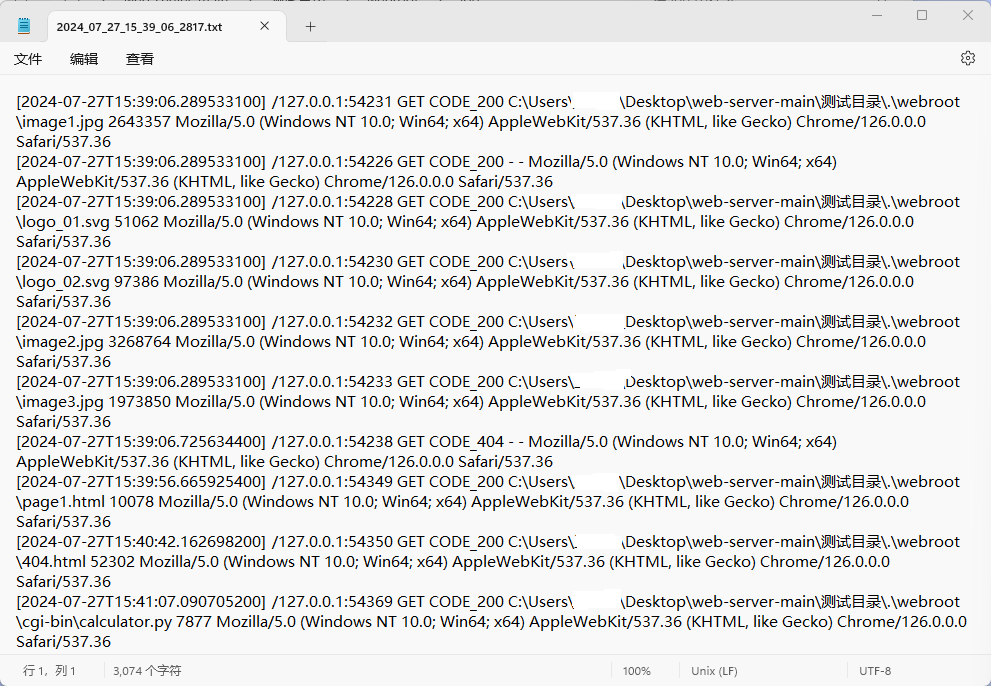

# Building a CGI-Support Multi-Threaded Web Server

支持CGI的多线程Web服务器。Web服务器使用`Java`编写，CGI脚本使用`Python`编写。

🔗[其他资源](https://github.com/wyt8/bit-cs)

## 🔍目录结构说明

* `web-server/`：IntelliJ IDEA项目目录，右键选择`Open Folder as IntelliJ IDEA Project`打开该目录，找到`Main`类的`main`方法运行即可。

* `实验报告/`：实验报告的Word版本和用到的图片。

* `测试目录/`：运行JAR包的目录

  * `WebServer.jar`：最终打成的JAR包
  * `webroot/`：Web服务器根目录，包含网页、图片、SVG文件、CGI脚本和最终生成的日志文件
    * `cgi-bin/`：CGI程序存放目录
    * `log/`：日志文件存放目录
    * ...

## 🛠️快速运行

1. 在`测试目录/`目录下右键打开终端，输入命令`java -jar ./WebServer.jar`运行JAR包。
    
2. 在浏览器中输入网址：`http://127.0.0.1:8888/`，即可显示首页，根据首页提供的超链接可以方便跳转到其他页面。
    * 首页
        
    * 页面1
        
    * 404页面
        
    * CGI程序
        

3. 在`webroot/log/`目录下可以看到生成的日志文件。
    

## 📒说明

1. 对于数据库查询的CGI应用，注意修改相应代码以适应自己的数据库配置。
2. CGI程序的除法没有进行异常处理，除数为0时会抛出异常。
